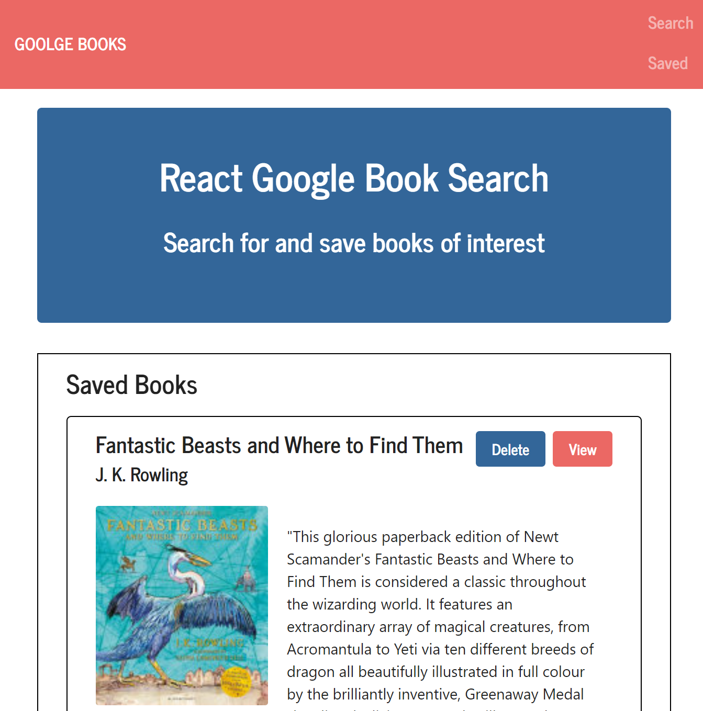

# Google Books Search

### Overview

This is a React-based Google Books Search app. I utilized React components, worked with helper/util functions, and utilized React lifecycle methods to query and display books based on user searches. I also used Node, Express and MongoDB so that users can save books to review or purchase later. I started by using a class activity as a base for the application.

### Contributions

1. Added code to connect to a MongoDB database named `googlebooks` using the mongoose npm package.

2. Using mongoose, created a Book schema.

3. Created React components.

4. Created a layout for the user interface that uses [`react-router-dom`](https://github.com/reactjs/react-router) to navigate, hide and show my React components without changing the route within Express.

5. Added Express routes for getting all saved books, posting new books to the database, and deleting individual books from the database by their id.

6. Deployed the application through Heroku

- - -

### Deployed Link
https://protected-badlands-39273.herokuapp.com/ 

## Screenshot

